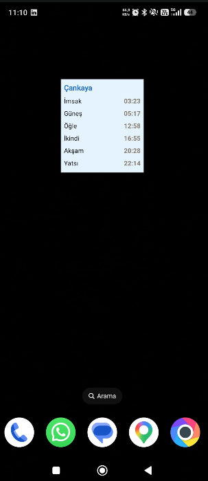
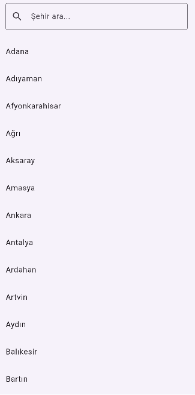

# Namaz Vakitleri

Türkiye için konum veya şehir seçimine göre namaz vakitlerini gösteren Flutter uygulaması. Ana ekranda günlük vakitleri listeler; Android ana ekranına 2x2 widget ekleyebilirsiniz.

## İndir (Android)

[](https://github.com/yalpayelekon/namaz_vakitleri_app/releases/latest)

APK dosyasını [GitHub Releases](https://github.com/yalpayelekon/namaz_vakitleri_app/releases/latest) sayfasından indirebilirsiniz:

**[namaz-vakitleri.apk indir](https://github.com/yalpayelekon/namaz_vakitleri_app/releases/latest/download/namaz-vakitleri.apk)**

> Play Store dışından APK yüklerken cihazınızda "Bilinmeyen kaynaklardan yükleme" izni gerekebilir.

## Özellikler

- Konuma göre otomatik namaz vakitleri (Aladhan API)
- 81 il için manuel şehir seçimi ve arama
- Şehir adı çözümleme: geocoding, OpenStreetMap ve en yakın il yedekleri
- Günün ayeti / hadisi
- Android 2x2 ana ekran widget'ı (şehir + tüm vakitler)

## Ekran Görüntüleri

### Ana ekran

Günlük namaz vakitleri, şehir bilgisi ve günün ayeti/hadisi.



### Şehir seçimi

81 il listesinden arama yaparak şehir seçebilirsiniz. AppBar'daki konum veya şehir ikonlarından da erişilir.



### Ana ekran widget'ı (2x2)

Şehir adı ve İmsak, Güneş, Öğle, İkindi, Akşam, Yatsı vakitlerini gösterir. Veriler uygulama açıldığında güncellenir.


## Widget ekleme (Android)

1. Ana ekranda boş bir alana uzun basın
2. **Widget'lar** seçeneğine dokunun
3. Listede **Namaz Vakitleri** widget'ını bulun (2x2)
4. Widget'ı ana ekrana sürükleyip bırakın

İlk kullanımdan önce uygulamayı en az bir kez açıp konum izni vermeniz veya bir şehir seçmeniz gerekir; aksi halde widget varsayılan metinleri gösterir.

## Kurulum

```bash
flutter pub get
flutter run
```

### Gereksinimler

- Flutter SDK ^3.8.1
- Android (widget desteği yalnızca Android'de)
- Konum izni (otomatik şehir için)

## Teknik notlar

| Katman | Açıklama |
|--------|----------|
| `lib/prayer_service.dart` | Vakit API, konum ve şehir adı çözümleme |
| `lib/city_store.dart` | Seçilen şehir / konum tercihi (SharedPreferences) |
| `lib/widget_service.dart` | Widget verisi kaydı ve native güncelleme |
| `android/.../HomeWidgetProvider.kt` | 2x2 widget provider |

Widget verileri Flutter `SharedPreferences` ile paylaşılır; Kotlin tarafı `FlutterSharedPreferences` üzerinden okur ve `MethodChannel` ile anında yenilenir.

## Lisans

Bu proje kişisel / eğitim amaçlıdır.
